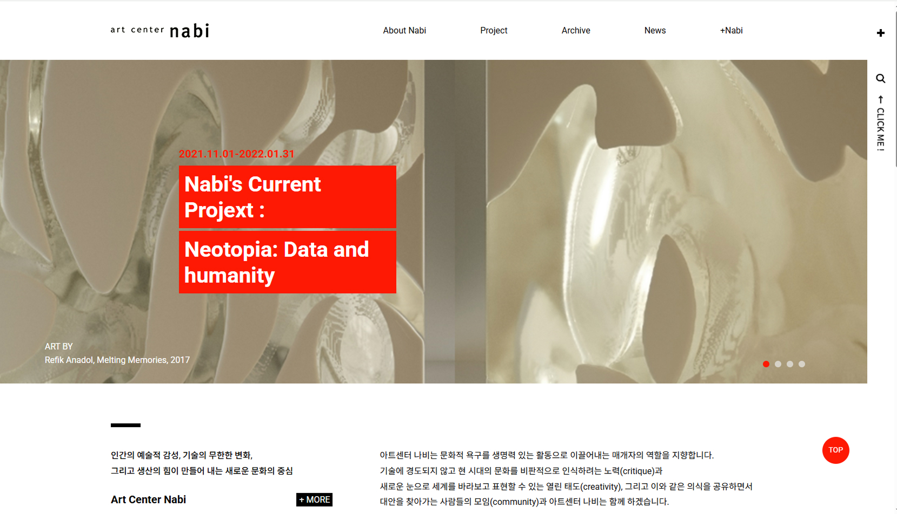
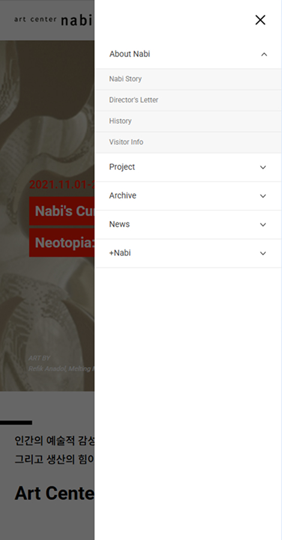
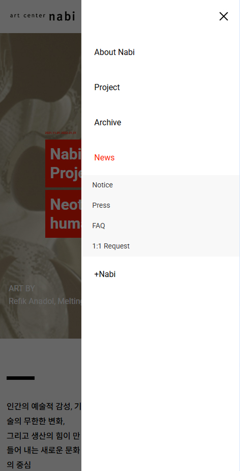
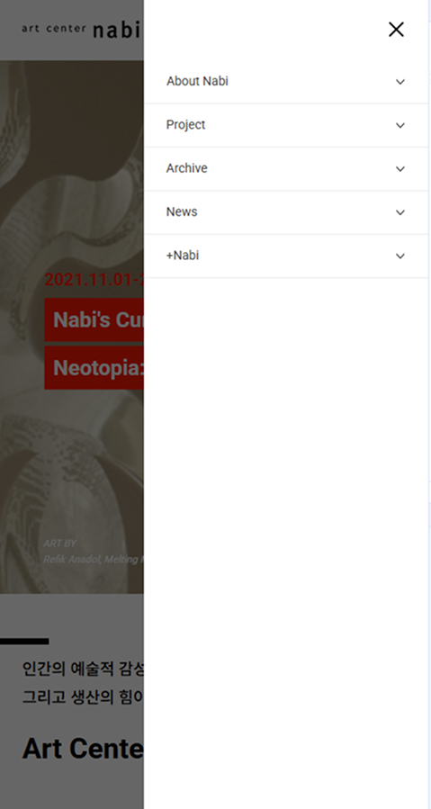
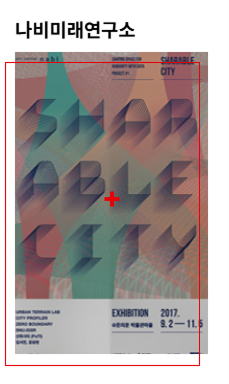

## 🎨 Artcenter Nabi 미술관 리뉴얼 웹사이트

아트센터 나비 미술관의 분위기와 정체성을 살려 리뉴얼한 반응형 웹사이트입니다. <br>
jQuery 기반의 DOM 제어로 사용자 상호작용을 구현하였고,  <br>
갤러리와 콘텐츠 중심의 디자인을 반영하였습니다.

<br/>

### 🎯 주요 기능

- 해상도에 따라 메뉴 구조 및 스타일 자동 변경
- 모바일 환경에서의 햄버거 메뉴 및 dim 처리
- 슬라이더 자동 재생, 컨트롤러 클릭 이동 기능
- 메뉴 hover 시 서브메뉴 활성화

<br/>

### 🛠️ 사용 기술

| 기술 | 설명 |
|------|------|
|  | 웹 표준을 준수한 마크업 구조 |
|  | 반응형 미디어쿼리 및 전반적 스타일링 |
|  | 메뉴 동작, 슬라이더 전환, 반응형 이벤트 구현 |

<br/>

### 📸 데모 이미지

| 메인 슬라이더 | 모바일 메뉴(1depth) | 모바일 메뉴(2depth) |
|-------------|----------------|-------------|
|  |  |  |


<br/>

### ⚙️ 기능 상세 설명

### ✅  1. 반응형 내비게이션 (PC/모바일 전환 감지)

- 윈도우 너비가 950px 이상이면 PC, 이하면 모바일로 인식합니다.
- 전환 시 메뉴 상태를 초기화합니다.


 ``` JavaScript
$(window).resize(function(){
		if(window.innerWidth > 950){
			if(isMobile != false){
				isMobile=false

				if($(".tab").hasClass("active") == true){
					$("nav > ul > li").each(function(index, item){
						let $item=$(item);

						$item.removeClass("active");
						$item.find("ul").slideUp(300);
					});

					$("body").removeClass("fixed");
					$("nav").removeClass("active");
					$(".tab").removeClass("active");
					$(".dimmed").removeClass("active");
				}
			}
		}
		else {
			if(isMobile != true){
				isMobile=true
			}
		}
	});

	$(window).trigger("resize");
```

---

### ✅ 2. PC 전용 내비게이션 메뉴 hover/focus 이벤트

- PC에서는 마우스나 키보드 포커스로 서브메뉴가 slideDown/slideUp으로 열립니다.
- 접근성 대응을 포함합니다. (focusin / focusout)


```javascript
$(".nav > ul > li").hover(
  function() {
    if (!isMobile) $(this).find("ul").stop().slideDown(300);
  },
  function() {
    if (!isMobile) $(this).find("ul").stop().slideUp(300);
  }
);

$(".nav > ul > li > a").focusin(function() {
  if (!isMobile) {
    $(this).parent().addClass("active");
    $(this).next("ul").slideDown(300);
  }
});

$(".nav ul ul li:last-child a").focusout(function() {
  if (!isMobile) {
    $(this).closest("li").removeClass("active");
    $(this).closest("ul").slideUp(300);
  }
});
```

---

### ✅  3. 모바일 메뉴 열기/닫기 (햄버거 탭 버튼)

- 모바일 상태일 때만 햄버거 탭으로 전체 메뉴를 열거나 닫습니다.
- 닫을 때는 모든 열린 서브메뉴를 초기화합니다.




```javascript
$(".tab").click(function(e) {
  e.preventDefault();
  if (isMobile) {
    if (!$(".tab").hasClass("active")) {
      $("body").addClass("fixed");
      $("nav, .tab, .dimmed").addClass("active");
    } else {
      $(".nav > ul > li").each(function(index, item) {
        let $item = $(item);
        $item.removeClass("active");
        $item.find("ul").slideUp(300);
      });
      $("body").removeClass("fixed");
      $("nav, .tab, .dimmed").removeClass("active");
    }
  }
});
```

### ✅  4. 모바일 메뉴 아코디언 서브메뉴

- 모바일에서는 클릭 시 아코디언처럼 서브메뉴가 열리고, 나머지는 닫힙니다.


```javascript
$(".nav > ul > li").click(function(e) {
  e.preventDefault();
  if (isMobile) {
    if (!$(this).hasClass("active")) {
      $(".nav > ul > li").removeClass("active");
      $(".nav li ul").slideUp(300);
      $(this).addClass("active");
      $(this).find("ul").slideDown(300);
    } else {
      $(this).removeClass("active");
      $(this).find("ul").slideUp(300);
    }
  }
});
```

---

### ✅  5. 슬라이더(배너) 갤러리

- 슬라이더에서 n번째 이미지와 컨트롤을 활성합니다.


```javascript
let n = 0;
let index = 0;
let total = 4;

$(".slider li").eq(n).addClass("active");
$(".slider .control li").eq(n).addClass("active");

function setGallery() {
  $(".slider li, .control li").removeClass("active");
  $(".slider li").eq(n).addClass("active");
  $(".slider .control li").eq(n).addClass("active");
}

function intervalMoving() {
  n = (n < total - 1) ? n + 1 : 0;
  setGallery();
}
```

---

### ✅  6. 슬라이더 컨트롤 클릭 & hover

- 슬라이더 컨트롤 클릭 시 해당 슬라이드로 전환합니다.
- hover 시 자동 슬라이딩 멈췄다가 hover 해제되면 다시 시작합니다.

```javascript
$(".slider .control li").click(function(e) {
  e.preventDefault();
  index = $(this).index();
  if (n !== index) {
    n = index;
    setGallery();
  }
});

$(".slider .control li").hover(
  function() {
    clearInterval(id);
  },
  function() {
    id = setInterval(intervalMoving, 5000);
  }
);
```

---

### ✅  7. 스크롤 시 ‘Top’ 버튼 표시 & 클릭 시 상단 이동

- 스크롤 위치가 100px 초과하면(header 높이) 상단 이동 버튼이 나타납니다.
- 버튼 클릭 시 부드럽게 상단으로 스크롤됩니다.



```javascript
$(window).scroll(function() {
  let t = $(window).scrollTop();
  if (t > 100) {
    $("#top").fadeIn(300);
  } else {
    $("#top").fadeOut(300);
  }
});

$("#top").click(function(e) {
  e.preventDefault();
  $("html").delay(300).animate({ scrollTop: 0 }, 500);
});
```

