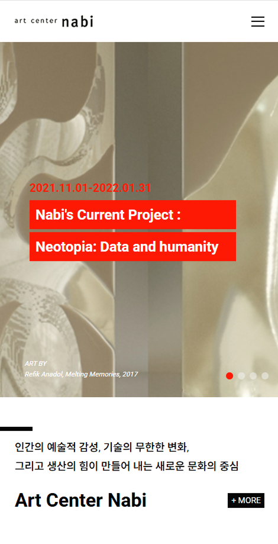

## 🎨 Artcenter Nabi 미술관 리뉴얼 웹사이트

아트센터 나비 미술관의 분위기와 정체성을 살려 리뉴얼한 반응형 웹사이트입니다. <br>
jQuery 기반의 DOM 제어로 사용자 상호작용을 구현하였고,  <br>
Swiper.js를 이용한 슬라이더와 다양한 해상도 대응을 고려한 구조로 제작하였습니다. <br>
갤러리와 콘텐츠 중심의 디자인을 반영하였습니다.

<br/>

### 🎯 주요 기능

- 해상도에 따라 메뉴 구조 및 스타일 자동 변경
- 모바일 환경에서의 햄버거 메뉴 및 dim 처리
- Swiper.js 기반 메인 슬라이더
- 슬라이더 자동 재생, 컨트롤러 클릭 이동 기능
- 720px 이하에서 상품 슬라이드형 배치 적용 (Swiper)
- 메뉴 hover 시 서브메뉴 활성화

<br/>

### 🛠️ 사용 기술

| 기술 | 설명 |
|------|------|
|  | 웹 표준을 준수한 마크업 구조 |
|  | 반응형 미디어쿼리 및 전반적 스타일링 |
|  | 메뉴 동작, 슬라이더 전환, 반응형 이벤트 구현 |
|  | 슬라이더 기능 구현 및 반응형 구성 |

<br/>

### 📸 데모 이미지

| 모바일 메뉴 | 메인 슬라이더 | 구글 맵 API |
|-------------|----------------|-------------|
|  |  |  |


<br/>

### ⚙️ 기능 상세 설명

### ✅  1. 모바일 메뉴 (Tab Menu)
- 메뉴 버튼 클릭 시 모바일 메뉴가 오픈됩니다.
- dim 또는 닫기 버튼 클릭 시 메뉴가 닫힙니다.
- 오픈 시 `body`에 `fixed` 클래스 추가로 스크롤 방지합니다.


 ``` JavaScript
tab.addEventListener("click", function(e){
  e.preventDefault();

  document.body.classList.add("fixed");
  mobile.classList.add("active");
  dim.classList.add("active");
});

dim.addEventListener("click", function(){
  document.body.classList.remove("fixed");
  mobile.classList.remove("active");
  dim.classList.remove("active");
});

closeBtn.addEventListener("click", function(e){
  e.preventDefault();

  document.body.classList.remove("fixed");
  mobile.classList.remove("active");
  dim.classList.remove("active");
});
```

---

### ✅ 2. 메인 슬라이더 (#main_slider)

- 페이지 네비게이션(fraction)입니다.
- 좌우 버튼 제어가 가능합니다.


```javascript
	const mainSwiper=new Swiper("#main_slider .swiper-container", {
		navigation: {
			prevEl: "#main_slider .swiper-button-prev",
			nextEl: "#main_slider .swiper-button-next"
		},
		pagination: {
			el: "#main_slider .swiper-pagination",
			type: "fraction"
		}
	});
```

---

### ✅  3. 서브 슬라이더 (#sub_slider)

- 모바일 기준 1.5개 노출, 태블릿 이상에서 3.5개가 노출됩니다.
- 반응형 설정 포함합니다.


```javascript
	const subSwiper=new Swiper("#sub_slider .swiper-container", {
		slidesPerView: 1.5,
		spaceBetween: 10,
		breakpoints: {
			640: {
				slidesPerView: 3.5,
				spaceBetween: 5
			}
		}
	});
```

---

### ✅ 4. Google Maps API

- 중심 좌표: 오뚜기 위치 (위도: 37.3901, 경도: 126.9715)
- 마커 타이틀: (주)오뚜기


```javascript
function initMap(){
	let myLatLng={lat: 37.390141551118695, lng: 126.97151846772532};

	let map=new google.maps.Map(document.getElementById("map"), {
		center: myLatLng,
		zoom: 16,
		mapTypeControl: false,
		zoomControl: false,
		fullscreenControl: false,
		rotateControl: false
	});

	let marker=new google.maps.Marker({
		position: myLatLng,
		map: map,
		title: "(주)오뚜기"
	});
}
```
